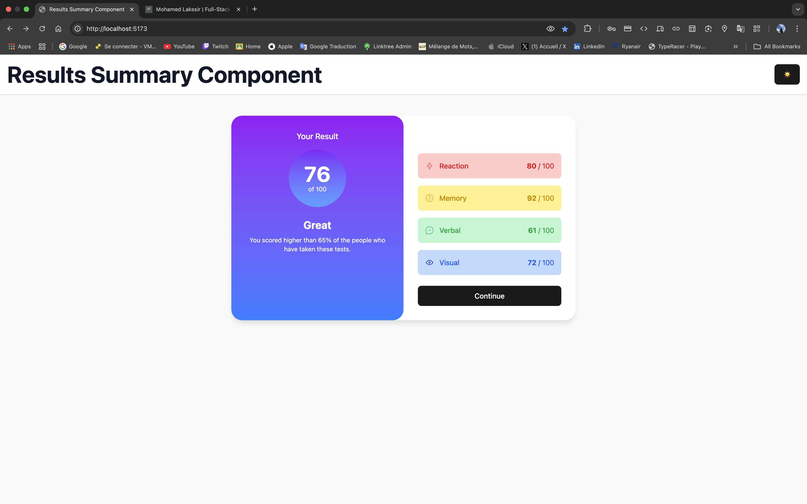

# Frontend Mentor - Results Summary Component Solution

This is a solution to the [Results Summary Component challenge on Frontend Mentor](https://www.frontendmentor.io/challenges/results-summary-component-CE_K6s0maV). Frontend Mentor challenges help you improve your coding skills by building realistic projects.

## Table of Contents

- [Frontend Mentor - Results Summary Component Solution](#frontend-mentor---results-summary-component-solution)
  - [Table of Contents](#table-of-contents)
  - [Overview](#overview)
    - [The Challenge](#the-challenge)
    - [Screenshot](#screenshot)
    - [Links](#links)
  - [My Process](#my-process)
    - [Built With](#built-with)
    - [Features](#features)
    - [What I Learned](#what-i-learned)
    - [Continued Development](#continued-development)
    - [Useful Resources](#useful-resources)
  - [Author](#author)
  - [Acknowledgments](#acknowledgments)

## Overview

### The Challenge

The goal was to build a results summary component that displays a user's test scores, including an overall average and individual category scores (Reaction, Memory, Verbal, Visual). Users should be able to:

- View the optimal layout for the interface depending on their device's screen size (mobile: 375px, desktop: 1440px)
- See hover and focus states for all interactive elements (e.g., the "Continue" button)
- Dynamically populate the content using the provided `data.json` file
- Toggle between light, dark, and system theme modes
- View their score comparison with other users

### Screenshot



This screenshot showcases the completed component with its key features:

- A gradient-styled "Your Result" section displaying an average score of 76/100
- A "Summary" section with category scores, each with unique colors and icons
- Theme toggle functionality for light/dark/system modes
- Responsive design that adapts to different screen sizes
- Modern UI with hover and focus states

### Links

- Solution URL: [Add solution URL here](https://your-solution-url.com)
- Live Site URL: [Add live site URL here](https://your-live-site-url.com)

## My Process

### Built With

- Semantic HTML5 markup
- TypeScript for type safety
- [React](https://reactjs.org/) - JS library for building UI components
- [React Router](https://reactrouter.com/) - For client-side routing
- [Tailwind CSS](https://tailwindcss.com/) - For responsive styling
- [tailwind-merge](https://github.com/dcastil/tailwind-merge) - For managing dynamic Tailwind class conflicts
- Context API for theme management
- Flexbox and CSS Grid for layouts
- Mobile-first workflow
- Vite - For fast development and bundling

### Features

1. **Theme Toggle System:**
   - Light mode for bright environments
   - Dark mode for reduced eye strain
   - System mode that follows the user's OS preferences
   - Persistent theme selection using localStorage

2. **Dynamic Data Loading:**
   - Scores loaded from data.json
   - Real-time average calculation
   - Category-specific styling and icons

3. **Responsive Design:**
   - Mobile-first approach
   - Fluid transitions between breakpoints
   - Optimized layouts for all screen sizes

### What I Learned

This project provided valuable experience in several areas:

1. **Theme Implementation:**

```tsx
// Using Context API for theme management
  const ThemeContext = createContext<ThemeContextType>({
    theme: 'system',
    setTheme: () => null,
  });
```

2. **Dynamic Data Handling:**

```tsx
const averageScore = categories.length
  ? Math.round(categories.reduce((sum, cat) => sum + cat.score, 0) / categories.length)
  : 0;
```

3. **Tailwind CSS Gradients:**

```tsx
<div className="bg-gradient-to-b from-light-slate-blue to-light-royal-blue">
  {/* Result content */}
</div>
```

### Continued Development

Future improvements I plan to implement:

- Add animations for theme transitions
- Implement more accessibility features
- Add user authentication to save progress
- Create a dashboard for tracking score history
- Optimize performance with React.memo and useMemo

### Useful Resources

- [Tailwind CSS Documentation](https://tailwindcss.com/docs) - Essential for styling
- [React Context API Guide](https://react.dev/reference/react/useContext) - Helped with theme implementation
- [Frontend Mentor Community](https://www.frontendmentor.io/community) - Valuable feedback and inspiration

## Author

- Website - [Mohamed Lakssir](https://your-website.com)
- Frontend Mentor - [@thejokers69ml](https://www.frontendmentor.io/profile/thejokers69ml)
- X - [@TheJokers69ML](https://x.com/TheJokers69ML)

## Acknowledgments

Special thanks to:

- Frontend Mentor for providing this challenge
- The developer community for feedback and support
- React and Tailwind CSS teams for their excellent documentation
